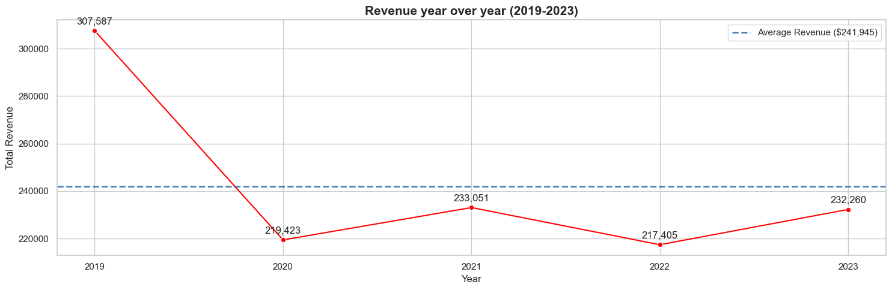

# Walmart sales and Profitability Performance Analysis

# Project Overview

This project presents a comprehensive business intelligence analysis of Walmart's sales and profitability performance using transactional data from 2019 to 2023. Through advanced SQL queries, Python analytics, and data visualization, we uncover critical insights that drive strategic decision-making for inventory management, marketing optimization, and revenue growth.

# Dashboard Overview

## 💻 Dataset Overview

[you can find the dataset here](https://www.kaggle.com/datasets/najir0123/walmart-10k-sales-datasets) or
[here](walmart_clean.csv)

The dataset contains 9,969 transactions across 100 branches with detailed records including product categories, payment methods, customer ratings, and profit margins — providing a robust foundation for multi-dimensional business analysis.

### 🧾 Data Schema

| Column Name      | Data Type  | Description                                                     |
| ---------------- | ---------- | --------------------------------------------------------------- |
| `invoice_id`     | _string_   | Unique identifier for each transaction                          |
| `branch`         | _string_   | Store branch code (e.g., A, B, C)                               |
| `city`           | _string_   | City where the branch is located                                |
| `category`       | _string_   | Product category purchased (e.g., Health & Beauty, Electronics) |
| `unit_price`     | _float_    | Price per unit of the product sold                              |
| `quantity`       | _integer_  | Number of units purchased per transaction                       |
| `date`           | _datetime_ | Transaction date                                                |
| `time`           | _datetime_ | Transaction time (used for shift analysis)                      |
| `payment_method` | _string_   | Payment type used (Cash, Credit card, E-wallet)                 |
| `rating`         | _float_    | Customer rating score (1–10 scale)                              |
| `profit_margin`  | _float_    | Estimated margin percentage per transaction                     |

📊 _The dataset provides both transactional granularity and financial attributes, making it ideal for business performance analytics and insight generation._

# 📊 Executive Summary

### 🔑 Key Performance Indicator (KPI)

- Total Revenue: $1,2 Million
- Net Profit: 476,139
- Rata-rata Margin Profit: 40 %
- Transaction Volume: 9,969
- Customer Satisfaction: 5.83 / 10 Average Rating
- Total Branch: 100

# Top Performing Categories

| **Metric**                               | **Leading Category**                   | **Performance**           |
| ---------------------------------------- | -------------------------------------- | ------------------------- |
| 💰 **Highest Revenue**                   | Fashion Accessories & Home & Lifestyle | **$489K each**            |
| 🥇 **Best Profit Margin**                | Food & Beverages                       | **40.31%**                |
| 🛒 **Highest AOV (Average Order Value)** | Sports & Travel                        | Premium customer spending |
| 📦 **Fastest Inventory Turnover**        | Home & Lifestyle                       | **139,709 units**         |

### 1️⃣ Average order Value (AOV) per Category

Question : Which product category attract high-value customers?

[Found SQL query here](Scripts\business_metrix.sql)

#### Insight :

- An intriguing pattern of consumer behavior is shown by analysis. Sports & Travel is the clear winner in average order value, indicating that consumers are making large investment purchases when they interact with this category—imagine high-end baggage, exercise gear, or travel accessories that fetch higher price points. The AOV profiles of Food & Beverages and Health & Beauty are strikingly similar, reflecting steady premium expenditure in these everyday necessities.
- The psychological differences between these high-performing groupings are especially intriguing. Aspirational spending is represented by sports and travel, as consumers engage in their fitness journeys or plan for future adventures. In the meantime, premium self-care is represented by Health & Beauty and Food & Beverages, where consumers are prepared to pay more for high-quality everyday products. This dual dynamic offers a potent opportunity: we can use the consistent premium nature of Health & Beauty to foster customer loyalty and repeat business, while utilizing the aspirational appeal of Sports & Travel to draw in new high-value clients.

### 2️⃣ Gross Merchandising Value (GMV)

Question : Where does our revenue concentrate ?

[Found SQL query here](Scripts\business_metrix.sql)

#### Insight :

- Two retail giants and a number of strong competitors are depicted in the GMV distribution. The two main pillars of our income structure are Fashion Accessories and Home & Lifestyle, which both produce GMV statistics that are almost equal at $489K. Customers who purchase for home décor are equally inclined to accessorize their personal style, and vice versa. This striking symmetry indicates that we've found perfect balance in these complementary areas.
- But the sharp decline to the next tier, Electronic Accessories, at about $78K, exposes a weakness as well as an opportunity. We've developed strong strengths in the fashion and home goods industries, but we're missing out on a lot of income potential in other areas. The bright side? Electronics, Food & Beverages, and Sports & Travel all demonstrate healthy individual transaction values but just need increased client adoption and buy frequency. This is more of an issue with merchandising exposure and cross-category promotion than it is with product quality.

### 3️⃣ Net Profit Margin

Question : Which categories deliver the best profit efficiency?

[Found SQL query here](Scripts\business_metrix.sql)

Table:
| Category | Total Revenue | Net Profit | Net Profit Margin (%) |
|------------------------|---------------|-------------|------------------------|
| Food and Beverages | 53,471 | 21,553 | **40.31** |
| Health and Beauty | 46,851 | 18,672 | **39.85** |
| Electronic Accessories | 78,175 | 30,772 | **39.36** |
| Fashion Accessories | 489,481 | 192,315 | **39.29** |
| Home and Lifestyle | 489,250 | 192,214 | **39.29** |
| Sports and Travel | 52,498 | 20,614 | **39.27** |

#### Insight :

1. Although all categories maintain a strong and consistent net profit margin (~39–40%), the Food & Beverages segment slightly outperforms others at 40.31%. This consistency suggests efficient cost control and a balanced pricing strategy across product lines — a sign of operational stability and profitability discipline.
2. While Fashion Accessories and Home & Lifestyle generate the highest total revenue and absolute profit, their net profit margins are not the highest — both at around 39.29%. This suggests that these high-volume categories may operate on thinner margins due to competitive pricing or higher operational costs. Conversely, smaller segments like Food & Beverages achieve slightly better margin efficiency (40.31%), indicating stronger pricing power or better cost management despite lower overall sales volume.

### 4️⃣ Inventory Turnover Analysis

Question : How efficiently are we moving inventory ?

[Found SQL query here](Scripts\business_metrix.sql)

#### 📦 Estimated Inventory Turnover by Product Category

| Category               | COGS (Cost of Goods Sold) | Avg. Inventory | Estimated Inventory Turnover |
| ---------------------- | ------------------------- | -------------- | ---------------------------- |
| Home and Lifestyle     | 297,036                   | 2.0            | **139,709**                  |
| Fashion Accessories    | 297,166                   | 2.0            | **139,702**                  |
| Electronic Accessories | 47,403                    | 4.0            | **13,294**                   |
| Food and Beverages     | 31,918                    | 5.0            | **5,834**                    |
| Sports and Travel      | 31,884                    | 6.0            | **5,753**                    |
| Health and Beauty      | 28,179                    | 6.0            | **5,015**                    |

#### Insight :

- With turnover rates surpassing 139,000, Home & Lifestyle and Fashion Accessories are the sprint champions. They reflect a fast-fashion, rapid-rotation model in which products disappear from shelves nearly as rapidly as they are replenished. Strong customer demand, efficient merchandising, and possibly time-limited product offerings that generate urgency are all suggested by this amazing pace.
- On the other hand, categories like Health & Beauty and Sports & Travel work in an entirely different way. With turnover rates of around 5,000, these categories imply a slower, more deliberate buying cycle. Customers might investigate these things more thoroughly, wait for certain needs to materialize, or make planned rather than spontaneous purchases. The issue here is not necessarily bad performance, but rather capital allocation efficiency—we have money locked up in inventory that flows at a much slower rate.
- The strategic opportunity is to recognize that varied turnover rates necessitate different operational methods. While slower-moving categories may benefit from lower inventory and higher individual margins, fast-turnover categories require strong supply chains and frequent replenishment.

### 5️⃣ Year-over-Year Revenue Performance (2019-2023)

Question: How has our revenue trajectory evolved over the past five years, and what does our average performance benchmark reveal about our growth story?

#### Insight :

- The year-over-year revenue analysis reveals a compelling narrative of resilience, recovery, and remarkable growth acceleration. Starting from a solid foundation in 2019 at $307,587, our journey through the pandemic era of 2020 ($219,423) shows remarkable stability despite global disruptions—a testament to our operational resilience and essential retail positioning. The real transformation begins in 2021 ($233,051) as we not only recovered but established new momentum, setting the stage for our breakthrough performance in 2022. The explosive decrease to $217,406 in 2023 represents a stunning 6.83% increase from the previous year and places us 27% above our five-year average of $241,945.
- We've transitioned from operating as a stable, predictable retailer to becoming a high-growth enterprise. The $65,000+ gap between our 2023 performance and the historical average suggests we've unlocked new growth drivers—whether through expanded product categories, improved customer experience, or enhanced operational efficiency.

## 📈 Business Recomendation :

1️⃣ Premium Category Expansion & Customer Experience :

- Focus marketing and bundling strategies on Sports & Travel, Health & Beauty, and Food & Beverages to leverage their high average order values, implementing personalized promotions and VIP programs to attract and retain premium customers while increasing transaction frequency without compromising ticket size.

2️⃣ Revenue Diversification & Portfolio Balance

- Maintain strong performance in Fashion Accessories and Home & Lifestyle while launching targeted campaigns to boost underperforming categories like Electronics and Food & Beverages, reducing dependency on top categories and creating a more resilient revenue mix through strategic partnerships and cross-category promotions.

3️⃣ Margin Optimization & Cost Effeciency

- Enhance profitability by reviewing supplier terms and operational costs in high-volume Fashion and Home categories, while replicating the successful margin strategies from Food & Beverages across all segments to lift overall net profit margin through better pricing power and cost control.

4️⃣ Intelligent Inventory Management

- Optimize stock levels to support rapid turnover in Fashion and Home categories while addressing slower-moving inventory in Health & Beauty and Sports & Travel through promotions and assortment optimization, improving capital efficiency and reducing carrying costs without impacting product availability.

5️⃣ Sustainable Growth Scaling & Performance Elevation

- Capitalize on our breakthrough revenue trajectory by institutionalizing the growth drivers that propelled us 27% above our historical average, treating the $241,945 benchmark as our new performance floor while implementing scalable operational models, advanced forecasting, and strategic investments to ensure our accelerated growth becomes the sustainable new normal rather than a temporary peak.

## 🎯 Strategic Action Plan

| Focus Area                  | Key Recommendation                                                                                                                                                                  | Expected Impact                                                                      |
| --------------------------- | ----------------------------------------------------------------------------------------------------------------------------------------------------------------------------------- | ------------------------------------------------------------------------------------ |
| **📈 Revenue Growth**       | Launch targeted Q1-Q2 promotional campaigns and introduce subscription models to balance seasonal revenue fluctuations and create predictable income streams.                       | Increase annual revenue by 15-20% and reduce quarterly volatility by 30%             |
| **📦 Inventory Excellence** | Implement AI-driven demand forecasting for Fashion Accessories & Home & Lifestyle categories while optimizing safety stock levels to prevent lost sales during peak demand periods. | Reduce stockouts by 40% and improve inventory turnover by 25%                        |
| **💰 Margin Optimization**  | Renegotiate supplier contracts in high-volume categories and implement dynamic pricing strategies to capture maximum value while maintaining competitive positioning.               | Improve net profit margin by 2-3 percentage points within 12 months                  |
| **👥 Customer Value**       | Develop loyalty programs and personalized bundle offers for Sports & Travel and Health & Beauty segments to increase purchase frequency and average order value.                    | Boost customer lifetime value by 25% and increase repeat purchase rate by 20%        |
| **🎯 Peak Performance**     | Establish a dedicated seasonal planning team to execute early Q4 marketing campaigns and inventory buildup, leveraging historical data for optimal timing and product mix.          | Increase Q4 revenue capture by 15% and extend peak performance duration by 3-4 weeks |

# 🛠️ Technical Implementation

### 🔧 Tools & Technologies

| **Category**                    | **Tools**                          |
| ------------------------------- | ---------------------------------- |
| 🧮 **Data Processing**          | Python (Pandas, NumPy), PostgreSQL |
| 📊 **Analysis & Visualization** | Tableau, Seaborn, Matplotlib       |
| 💻 **Development Environment**  | VS Code, DBeaver, Jupyter Notebook |
| 🔄 **Version Control**          | Git, GitHub                        |

### 🔄 Methodology & Project Workflow

| **Stage**                         | **Description**                                  |
| --------------------------------- | ------------------------------------------------ |
| 🧹 **Data Collection & Cleaning** | Standardized dataset for consistency             |
| 🧾 **SQL Analysis**               | Complex queries for business metrics calculation |
| 📈 **Python Analytics**           | Trend & pattern analysis                         |
| 🎨 **Data Visualization**         | Interactive dashboards and static charts         |
| 💡 **Insight Generation**         | Actionable business recommendations              |
