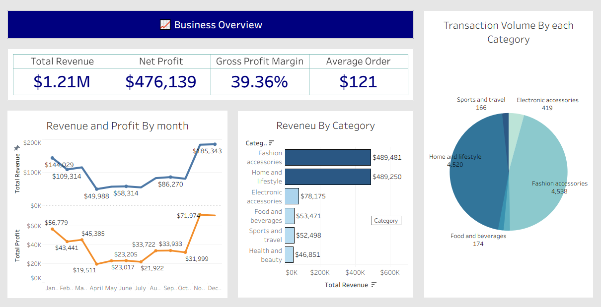

# Walmart sales and Profitability Performance Analysis

# Dashboard Overview



## 💻 Dataset Overview

[you can find the dataset here](https://www.kaggle.com/datasets/najir0123/walmart-10k-sales-datasets) or
[here](walmart_clean.csv)

This project uses a **Walmart Transactions Dataset**, containing sales records from multiple branches between **2019 and 2023**. The dataset provides transactional-level details used to analyze sales performance, customer behavior, and profitability metrics.

### 🧾 Data Schema

| Column Name      | Data Type  | Description                                                     |
| ---------------- | ---------- | --------------------------------------------------------------- |
| `invoice_id`     | _string_   | Unique identifier for each transaction                          |
| `branch`         | _string_   | Store branch code (e.g., A, B, C)                               |
| `city`           | _string_   | City where the branch is located                                |
| `category`       | _string_   | Product category purchased (e.g., Health & Beauty, Electronics) |
| `unit_price`     | _float_    | Price per unit of the product sold                              |
| `quantity`       | _integer_  | Number of units purchased per transaction                       |
| `date`           | _datetime_ | Transaction date                                                |
| `time`           | _datetime_ | Transaction time (used for shift analysis)                      |
| `payment_method` | _string_   | Payment type used (Cash, Credit card, E-wallet)                 |
| `rating`         | _float_    | Customer rating score (1–10 scale)                              |
| `profit_margin`  | _float_    | Estimated margin percentage per transaction                     |

📊 _The dataset provides both transactional granularity and financial attributes, making it ideal for business performance analytics and insight generation._

## ⚖ Finding Overview

The analysis is based on 9,969 transactions recorded across 100 branches between 2019 and 2023, generating a total revenue of $1.21 million and a net profit of $476,139, with an average profit margin of 40% and an average customer rating of 5.83.

From the findings:

- The Fashion Accessories and Home & Lifestyle categories dominate total revenue and inventory turnover, each exceeding $489K in sales and 139K in estimated turnover rate.
- Meanwhile, Food & Beverages leads in net profit margin (40.31%), showing higher efficiency in cost management.
- High-value customers tend to purchase from Sports & Travel, Health & Beauty, and Food & Beverages, which record the highest average order values.
- Quarter 4 consistently shows peak revenue performance, with sales reaching $105K in 2023, suggesting strong seasonal demand during year-end promotions.
- Payment data indicates that credit cards and e-wallets account for over 80% of all transactions, reflecting a strong customer shift toward digital payments.

## 📊 Analysis Breakdown

### Key Performance Indicator (KPI)

- Total Transaksi: 9,969
- Total Branch: 100
- Total Revenue: $1,209,726
- Net Profit: 476,139
- Rata-rata rating produk: 5.83
- Rata-rata Margin Profit: 0.4

#### 1️⃣ Average order Value per Category

Which product category generates the highest average order value?

[Found SQL query here](Scripts\business_metrix.sql)

```sql
SELECT
	category,
	round(sum(unit_price::NUMERIC * quantity::NUMERIC) /
	count(DISTINCT invoice_id), 0) AS avg_order_value
FROM
	walmart
GROUP BY
	category
ORDER BY
	avg_order_value DESC;
```


#### Insight :

Sports and Travel, Health and Beauty, and Food and Beverages are our top-performing categories by average order value (AOV), significantly outpacing the others. This suggests our strategy in these areas is effectively driving higher-value purchases.

#### 2️⃣ Gross Merchandising Value (GMV)

Question :

Which categories contribute the most highest GMV?  
[Found SQL query here](Scripts\business_metrix.sql)

```sql
WITH highest_gmv AS (
	SELECT
		category,
		round(sum(unit_price::NUMERIC * quantity::NUMERIC), 0) AS gmv,
		ROW_NUMBER() OVER(PARTITION BY category ORDER BY sum(unit_price::NUMERIC * quantity::NUMERIC) DESC) AS rn
	FROM walmart
	GROUP BY (1)
)
SELECT
	category,
	gmv
FROM highest_gmv
WHERE rn = 1
ORDER BY gmv desc;
```


#### Insight :

**Fashion Accessories** and **Home & Lifestyle** categories generate nearly identical and the highest _GMV_, indicating that these two product lines are the primary revenue drivers. However, the sharp drop in _GMV_ among other categories suggests potential opportunities to diversify sales or strengthen marketing efforts for underperforming segments like Electronics and Food & Beverages.

#### 3️⃣ Net Profit Margin

Question :

Which product category achieves the highest profit efficiency (NPM)?  
[Found SQL query here](Scripts\business_metrix.sql)

```sql
WITH profit_margin AS (
	SELECT
		category,
		round(sum(unit_price::NUMERIC * quantity::NUMERIC), 0) AS total_revenue,
		round(sum(unit_price::NUMERIC * quantity::NUMERIC * profit_margin::NUMERIC), 0) AS net_profit
	FROM walmart
	GROUP BY category
)
SELECT
	category,
	total_revenue,
	net_profit,
	round((net_profit / total_revenue)* 100.0, 2) AS net_profit_margin_pct
FROM profit_margin
ORDER BY net_profit_margin_pct DESC;
```

Table:
| Category | Total Revenue | Net Profit | Net Profit Margin (%) |
|------------------------|---------------|-------------|------------------------|
| Food and Beverages | 53,471 | 21,553 | **40.31** |
| Health and Beauty | 46,851 | 18,672 | **39.85** |
| Electronic Accessories | 78,175 | 30,772 | **39.36** |
| Fashion Accessories | 489,481 | 192,315 | **39.29** |
| Home and Lifestyle | 489,250 | 192,214 | **39.29** |
| Sports and Travel | 52,498 | 20,614 | **39.27** |


#### Insight :

1. Although all categories maintain a strong and consistent net profit margin (~39–40%), the Food & Beverages segment slightly outperforms others at 40.31%. This consistency suggests efficient cost control and a balanced pricing strategy across product lines — a sign of operational stability and profitability discipline.
2. While Fashion Accessories and Home & Lifestyle generate the highest total revenue and absolute profit, their net profit margins are not the highest — both at around 39.29%. This suggests that these high-volume categories may operate on thinner margins due to competitive pricing or higher operational costs. Conversely, smaller segments like Food & Beverages achieve slightly better margin efficiency (40.31%), indicating stronger pricing power or better cost management despite lower overall sales volume.

#### 4️⃣ Inventory Turnover

Question :

Does high turnover align with high sales or efficient stock movement?

[Found SQL query here](Scripts\business_metrix.sql)

```sql
WITH inventory_turnover AS (
	SELECT
		category,
		round(sum(unit_price::NUMERIC * quantity::NUMERIC * (1 - profit_margin::NUMERIC)), 0) AS cogs,
		round(avg(quantity::NUMERIC), 0) AS avg_inventory
		-- (estimasi dan asumsi)
	FROM walmart
	GROUP BY category
)
SELECT
	category,
	cogs,
	avg_inventory,
	round(cogs / avg_inventory, 0) AS est_inventory_turnover
FROM inventory_turnover
ORDER BY est_inventory_turnover DESC;
```

### 📦 Estimated Inventory Turnover by Product Category

| Category               | COGS (Cost of Goods Sold) | Avg. Inventory | Estimated Inventory Turnover |
| ---------------------- | ------------------------- | -------------- | ---------------------------- |
| Home and Lifestyle     | 297,036                   | 2.0            | **139,709**                  |
| Fashion Accessories    | 297,166                   | 2.0            | **139,702**                  |
| Electronic Accessories | 47,403                    | 4.0            | **13,294**                   |
| Food and Beverages     | 31,918                    | 5.0            | **5,834**                    |
| Sports and Travel      | 31,884                    | 6.0            | **5,753**                    |
| Health and Beauty      | 28,179                    | 6.0            | **5,015**                    |


#### Insight :

Home & Lifestyle and Fashion Accessories categories dominate inventory turnover — each exceeding 139K, far ahead of other segments. This indicates that these categories experience rapid stock movement and high consumer demand, reflecting strong sales performance and efficient inventory cycles. Conversely, categories such as Health & Beauty and Sports & Travel have much lower turnover, suggesting potential overstocking or slower product rotation that may tie up capital.

#### 5️⃣ Quarterly Revenue Trend (2022-2023)

Question :

Which quarter across 2022–2023 recorded the highest total revenue each year?

[Found Python Code Here](walmart_analysis.ipynb)


#### Insight :

Revenue trends from 2022 to 2023 show clear quarterly fluctuations, with sharp spikes in Q4 of both years (reaching 100K in 2022Q4 and 105K in 2023Q4). This pattern indicates strong seasonal demand toward the end of the year — possibly due to holiday promotions or year-end sales campaigns. Meanwhile, mid-year quarters (Q2–Q3) remain relatively stable but lower, suggesting potential opportunities to balance sales performance throughout the year.

## 📈 Business Recomendation :

- 1️⃣ Focus marketing and cross-selling efforts on Sports & Travel, Health & Beauty, and Food & Beverages, which show the highest AOV. These categories attract high-spending customers, so personalized promotions or bundle discounts could increase order frequency without lowering ticket size. For lower AOV categories, review pricing strategy or product bundling to lift average spend per transaction.
- 2️⃣ Maintain strong momentum in Fashion Accessories and Home & Lifestyle, which are the top revenue drivers. However, to sustain long-term growth, consider developing targeted campaigns to boost underperforming categories like Electronics and Food & Beverages. This diversification reduces revenue dependency on a few product lines and supports balanced portfolio growth.
- 3️⃣ While overall margins are stable across categories (~39–40%), focus on optimizing cost efficiency within Fashion Accessories and Home & Lifestyle, which, despite high sales, operate on thinner margins. A cost review or supplier negotiation in these categories could increase profitability. Additionally, replicate successful pricing or sourcing strategies from Food & Beverages, which demonstrates better margin efficiency.
- 4️⃣ Ensure sufficient stock levels for Home & Lifestyle and Fashion Accessories, where rapid turnover reflects high demand. At the same time, evaluate inventory management for Health & Beauty and Sports & Travel, which show slower rotation — consider reducing order volume, running promotions, or optimizing SKU assortment to avoid capital lock-up in low-movement inventory.
- 5️⃣ Leverage Q4’s strong seasonal momentum by planning early campaigns and inventory ramp-ups before peak season. To stabilize revenue across the year, explore strategies that drive engagement during off-peak quarters (Q2–Q3), such as mid-year promotions, loyalty programs, or special product launches. This helps smooth out sales volatility and maintain consistent cash flow.

## 💻 Technical Details

1. Database : [Walmar Dataset](walmart_clean.csv) / walmart_db
2. Analysis Tools :
   - Python
   - PostgreSQL
   - VS Code
   - Dbeaver
3. Visualization Tools :
   - Python (Seaborn, Matplotlib, Pandas)
   - Tableau
