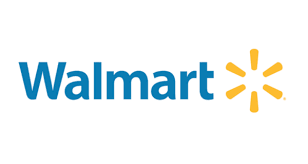
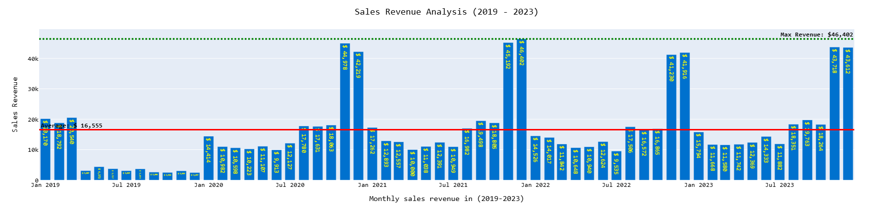
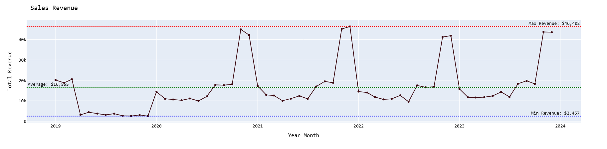
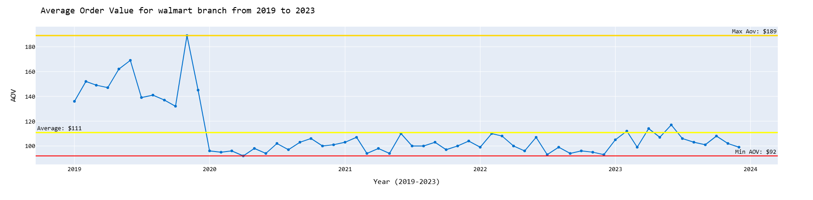
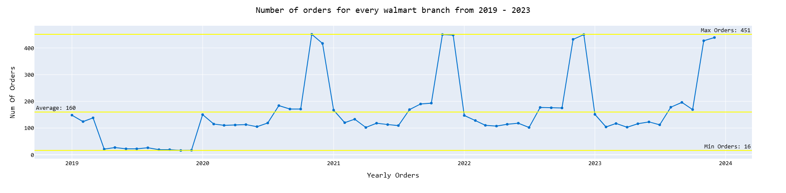
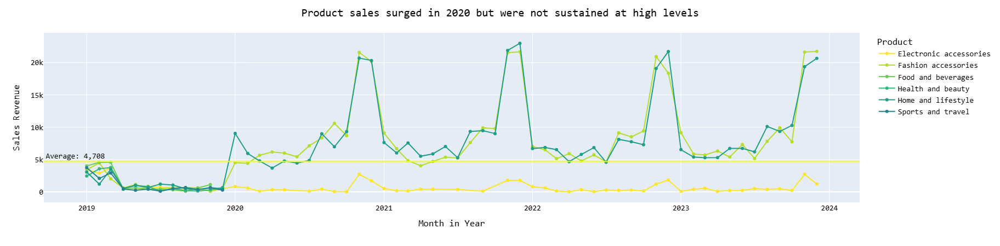
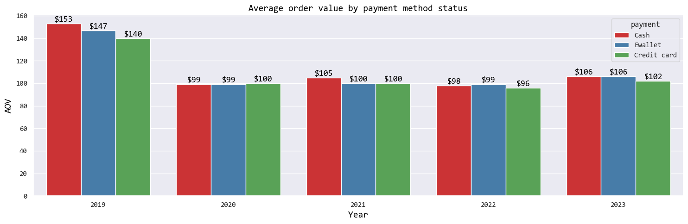
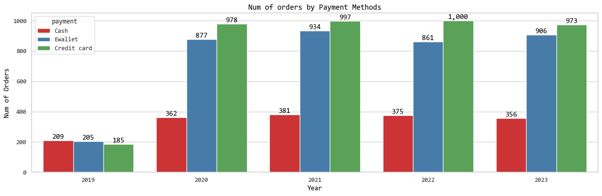
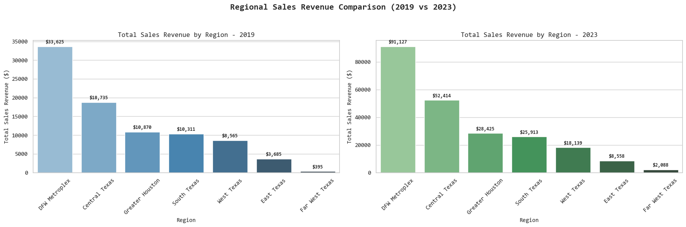

    

<h1 align="center">Walmart Branch Performance Report</h1>

<h1 align='center'>Client Background</h1>

**Walmart** is a U.S.-based retail corporation that operates a chain of hypermarkets, discount, department stores and grocery to serve consumers across the United States and globally. Established in 1962, the company has grown and expanded in the last few years, it has encountered increasing competition from e-commerce giants and traditional retailers as well as unique challenges and opportunities brought on by the COVID-19 pandemic.

Walmart's book of business is approaching 9,600 transactions across 100 branches generating sales revenue exceeding $993,319 based on gross revenue. The available retail data spans various dimensions and metrics, including sales, products category, sales by regions, payment method, and branch rating.

Reporting to the head of operations, an in-depth analysis was conducted to evaluate Walmart's branch performance over the past several years (2019-2023). This comprehensive review provides valuable insights that internal cross-functional teams will utilize to stream recommendations focused on the following areas:

**NorthStar Metrics:**

- **Sales Trends** - Focusing on key metrics of sales revenue, number of orders placed and average order value (AOV)
- **Product Performance** - Analyzing different category lines, market impact, and branch ratings to inform product strategy
- **Payment method evaluation** - Evaluating the effectiveness of different payment methods and providing recommendations to maximize customer convenience and retention
- **Regional results** - Evaluating regional demand and product performance within regions to identify areas for improvement

---

<h1 align='center'>Executive Summary</h1>

### Key Findings

**1. Revenue Growth and Peak Performance**

- Q4 has always been the strongest period, with consistent sales and revenue consistently reaching $40,000, even though Q4 2020 was still affected by the COVID-19 pandemic
- Q4 2021 saw the highest revenue ($46,402 in December 2021), making it the best performing period
- Each Q4 has reached revenue of up to $40,000, and it also maintained strong sales in the final year, despite a downward trend that started afterward

**2. Declining Trend in Every Early Quarter**

- Sales anomalies and significant declines always occur in our early quarters (Q1-Q3), especially in Q2-Q3 with sales revenue of only $2,000-$4,000 per month during that quarter, marking the quarters with the lowest revenue
- The Q2-Q3 revenue decline suggests a major downturn, likely caused by external branch conditions, reduced consumer demand or internal operational shifts

**3. Quarterly Insights & Seasonal Trends**

- Q4 of each year typically shows strong performance, likely due to seasonal shopping trends and marketing efforts
- Q1 2023 started badly ($15,794 in January), but revenue still went up and down through Q1-Q3, but revenue quickly grew in Q4, signaling an overall peak performance compared to every Q1-Q3 in previous years

**4. Key Takeaways & Recommendations**

- Investigate the causes of the every Q1-Q3 period decline for every year (e.g., market changes, competition, internal factors)
- Leverage high-performing periods (e.g., Q4 of strong years) to refine marketing and branch sales strategies
- Reassess business strategy for 2024, focusing on pricing, branch promotions and customer engagement to regain momentum

---

## Dataset Structure

The database structure as seen below consists of one table with a total row count of 9,599 records.

| Column Name      | Data Type | Description                            |
| ---------------- | --------- | -------------------------------------- |
| `invoice_id`     | Integer   | Unique identifier for each transaction |
| `branch`         | String    | Branch code where transaction occurred |
| `city`           | String    | City location of the branch            |
| `category`       | String    | Product category                       |
| `unit_price`     | Float     | Price per unit of product              |
| `quantity`       | Float     | Number of units purchased              |
| `date`           | String    | Transaction date                       |
| `time`           | Date      | Transaction time                       |
| `payment_method` | String    | Method of payment used                 |
| `rating`         | Float     | Customer satisfaction rating           |
| `profit_margin`  | Float     | Profit margin percentage               |
| `revenue`        | Float     | Total revenue from transaction         |
| `net_profit`     | Float     | Net profit from transaction            |
| `region`         | String    | Geographic region of branch            |

---

## Key Performance Indicators

<table width=100%, height=auto>
<tr>
<td align="center"><b>Analysis Period</b> <h2>2019-2023</h2></td>
<td align="center"><b>Order Period</b> <h2>1,825 days</h2></td>
<td align="center"><b>Total Orders</b> <h2>9,599</h2></td>
</tr>
<tr>
<td align="center"><b>Total Branches</b> <h2>100</h2></td>
<td align="center"><b>Total Cities</b> <h2>98</h2></td>
<td align="center"><b>Product Categories</b> <h2>6</h2></td>
</tr>
<tr>
<td align="center"><b>Total Quantity Sold</b> <h2>20,468</h2></td>
<td align="center"><b>Total Revenue</b> <h2>$993,319</h2></td>
<td align="center"><b>Total Profit</b> <h2>$390,733</h2></td>
</tr>
<tr>
<td align="center"><b>Average Branch Rating</b> <h2>5.78 / 10</h2></td>
<td align="center"><b>Branch Rating Range</b> <h2>3.0 - 10.0</h2></td>
<td align="center"><b>Payment Methods</b> <h2>3</h2></td>
</tr>
<tr>
<td align="center"><b>Maximum Profit Margin</b> <h2>57%</h2></td>
<td align="center"><b>Average Profit Margin</b> <h2>39.3%</h2></td>
<td align="center"><b>Average Order Value</b> <h2>$103.47</h2></td>
</tr>
</table>

---

<h1 align='center'> Insight Deep-Dive</h1>
<h1 align='center'>Sales Trend</h1>

#### Sales Revenue

**1. Sharp spike in Q4 2023 - A major sales peak performance**

- Historically, Q4 (Nov-Dec) has been the strongest quarter due to holiday shopping (Black Friday, Cyber Monday, Christmas sales) and also in 2023 Q4 sales peak performance
- December 2023 sales were UP compared to December in previous years (a 4.05% increase from the previous best December). However, December 2023 ($43,612) was 6.01% below the absolute monthly sales peak ($46,402) reached at the end of 2021 and repeated at the end of 2024

**2. Post Pandemic Sales Normalization (2020-2022)**

- 2020 Sales Surge: The Pandemic led to a significant boost in retail sales, with Q2-Q4 2020 seeing a rapid increase (e.g., **Q4 2020 was nearly double Q4 2019**)
- 2021 Slight Slowdown: Sales remained high but started stabilizing, showing a decline from pandemic peak levels, and also seeing rapid increase at Q4 period
- 2022 Major Decline: An inconsistent drop in sales across all quarters suggests a post-pandemic correction, with inflation, lower consumer spending or increased competition

**3. Declining growth throughout every quarter (Q1-Q3) period - indicating weak consumer demand**

- For each quarter for Q1-Q3 in the period, it experienced ups and downward trends
- Q1: Started fairly strong ($20,170 in Jan) and still higher than 2020
- Q2-Q3: Sales declined sharply (especially from June to July) after the previous Q4 peak, with the steepest drop reaching 42% in 2021, then sales tended to stabilize or decline slowly at a low level until the end of Q3
- Q4: The most consistent and strongest peak sales period, reaching an all-time high of $46,402 (occurring in 2021 and 2024). This pattern indicates very strong seasonal demand at the end of the year, which can be further optimized through pre-holiday and end-of-year campaign strategies

#### Average Order Value

**1. Sharp AOV surge in 2019, followed by a Decline in 2020-2023**

- 2019 saw the highest AOV decline, declined at $96 (Nov 2020) compared to $189 (Nov 2019), aligning with pandemic-driven branch retail boom
- Post pandemic correction (2020-2022) led to a steady decline, with AOV in 2022 returning close to 2020 levels (~$96-$101)

**2. 2020-2023 AOV is lower and relatively more volatile compared to previous years**

- **2020-2023 AOV fluctuates significantly between $114 (Apr) and $117 (Jun)**
- Q4 2022 AOV is significantly lower than Q4 2020 & 2023, meaning holiday spending per order has dropped in 2022

**3. Long-Term AOV decline may indicate price sensitivity**

- From a peak of ~$189 in 2019, AOV steadily dropped to ~$99 in 2023 which is ~47.62% drop
- Over the span of four years, the change in AOV growth has been relatively constant, indicating minimal changes in category product pricing
- AOV in 2020-2023 is likely to be a major factor in decline of sales that year

#### Order Count

- **Total Orders dropped by ~39.5%** from the peak in December 2021 (451 orders) to the trough in July 2022 (around 120 orders), or from peak to trough in 2022
- The most significant decline in order volume started in early 2022, with the count falling sharply from the peak of 451 orders (December 2021) to a low of approximately 120 orders (around mid-2022)
- The consistent drop in order frequency is the primary driver of the lower sales revenue during the low-demand periods (Q1, Q2 and Q3), overwhelming the impact of minor fluctuations in average order value

---

**Sales Growth follows pronounced seasonal fluctuations, primarily driven by Order Volume, while AOV Growth remains relatively low and stable throughout the year. This indicates that the large revenue swings are a factor of how many orders are placed, rather than how much customers spend per transaction.**

---

### Product Performance

**Product Sales Surged in 2020 but were not Sustained at High Levels**

#### The Best and Worst

- The Fashion Accessories category had consistently strong sales year over year totaling $454,531, and it is the highest revenue generating product overall
- The second and third best performing products category in terms of sales are Home and Lifestyle ($453,878 total) and Electronic Accessories ($410,031 in total)
- The Sport and Travel ($12,477 total) had extremely low sales compared to other products, with no sales record in multiple months

#### AOV Over Time

- The AOV peaked in 2019 at $158 and then declined in 2020 ($98) and we have a stable AOV in the next years
- Home and Lifestyle ($117,649), Fashion accessories ($113,847) and Electronic Accessories ($39,000) are the biggest contributors to AOV
- Home and Lifestyle, Health and Beauty, Food and Beverages and Electronic Accessories have relatively low price points on average. They are stable but do not significantly impact AOV
- AOV is trending downward but mainly due to a decline of product sales

#### Heat Map Findings

- Consistent Q4 spikes, likely due to Black Friday, Cyber Monday and the holiday shopping season for several products
- Biggest Q4 performer: Fashion Accessories, Home and Lifestyle saw the biggest spikes
- Sales tend to drop in January and February after the holiday season in Q1
- Fashion Accessories, Home and Lifestyle also Electronic Accessories maintain consistent demand as sales through Q1-Q3 remain relatively stable but lower than in Q4

<table>
<tr>
<td width="50%">
<h4 align="center">AOV Over Time (2019-2023)</h4>

</td>
<td width="50%">
<h4 align="center">Product Sales Heatmap by Quarter</h4>

</td>
</tr>
</table>

---

### Payment Methods Program Learnings

<table>
<tr>
<td width="50%">
<h4 align="center">Average Order Value by Payment Methods</h4>

</td>
<td width="50%">
<h4 align="center">Number of Orders by Payment Methods</h4>

</td>
</tr>
</table>

- Digital payment methods (ewallet and credit card) drove a significant growth in order volume between 2019 and 2023. In 2023, the number of digital orders (Ewallet: 906, Credit Card: 973) outnumbered cash orders (356), indicating a permanent change in client preferences toward cashless payments
- From 2019 to 2020, Average Order Value (AOV) decreased dramatically for all payment types. Cash AOV dropped from $153 to $99, while Ewallet declined from $147 to $99, indicating a significant decrease in transaction value at the start of the epidemic period
- Despite a dip in 2020, AOV for digital payments (ewallet and credit card) continued to recover and stabilize. In 2023, the AOV for Ewallet and Cash hit its peak ($106), followed by Credit Card ($102), reflecting a resurgence in transaction value aided by cashless payments
- AOV Cash, which peaked in 2019 ($153), was unable to sustain its dominance. Since 2022 and 2023, AOV for digital payments (e-wallets and credit cards) has reached or surpassed AOV Cash, indicating that customers who utilize digital payments are now consistently making purchases of the same or higher transaction value

---

### Regional Results (2019 vs 2023)

**1. The DFW Metroplex region contributes the most sales revenue for products in each Walmart branch**

- CAGR of 28.35% of total sales per product
- $91,172 in 2023

**2. In contrast, Walmart branch sales have underperformed in the Far West Texas region**

- Far West Texas region ranks lowest in terms of Sales Revenue
- Despite starting from a very low base ($395 in 2019), this region showed remarkable growth to $2,088 in 2023
- The average annual sales increase (CAGR) was approximately 51.63%

**3. Central Texas: Emerging High-Potential Market**

- Central Texas demonstrates the strongest combined performance with $52,414 in 2023 revenue and a 29.4% CAGR, the highest growth rate among major revenue-generating regions
- This region contributes 23% of total revenue while maintaining growth momentum that exceeds even the DFW Metroplex
- The company should prioritize expansion and marketing investments in Central Texas as it represents the best opportunity for substantial revenue gains with proven market demand and lower concentration risk than continuing to focus solely on DFW

**4. West and East Texas: Underperforming Regions Requiring Strategic Review**

- West Texas and East Texas combine for only 12% of total revenue despite having four years of operation, with West Texas showing the slowest CAGR at 20.6% among all regions
- Both regions have declining revenue share over the period, suggesting they are not keeping pace with company growth or market opportunities
- Management should conduct a profitability analysis and competitive assessment to determine if these regions require operational improvements, increased marketing support, or strategic exit to reallocate resources to higher-performing markets

---

## Recommendations

Based on the uncovered insights, here are actionable items that Walmart Branch can take away from our analysis.

## Sales Strategy

**Maximize Q4 Performance and Reduce Seasonal Volatility**

- Q4 consistently delivers peak revenue with 227% average growth, but Q1-Q3 periods see sharp declines of up to 42%. Launch pre-holiday campaigns in October and extend promotions into January with "New Year" themed sales to maintain momentum. Address off-peak quarters with targeted initiatives like back-to-school events in Q3, summer sales in Q2, and spring campaigns in Q1 to smooth revenue fluctuations throughout the year.

**Reverse Order Volume Decline**

- Order count dropped 39.5% from 451 orders in December 2021 to 120 orders by mid-2022, making it the primary driver of revenue decline rather than AOV changes. Implement customer reactivation programs targeting lapsed buyers, introduce flash sales and limited-time offers to create urgency, and leverage email marketing with personalized product recommendations to increase transaction frequency across all quarters.

## Product Strategy

**Double Down on Top Three Categories**

- Fashion Accessories ($454,531), Home and Lifestyle ($453,878), and Electronic Accessories ($410,031) generate the majority of revenue. Prioritize these categories with expanded inventory during Q4, prominent store placement, and increased marketing spend. Create cross-category bundles to drive higher transaction values and ensure adequate stock levels from October through December when these categories peak.

**Address Underperforming Sport and Travel Category**

- With only $12,477 total revenue and multiple months of zero sales, this category requires immediate strategic review. Either reposition the product mix toward higher-demand items and launch targeted seasonal campaigns, or discontinue the category and reallocate resources to proven performers. Make a definitive decision within the next quarter to avoid continued resource drain.

**Recover Average Order Value**

- AOV declined 47.62% from $189 (2019) to $99 (2023), significantly impacting revenue potential. Implement tiered shipping thresholds that incentivize larger purchases, create product bundles with slight discounts, and focus on upselling higher-margin items within top-performing categories. Target a 15-20% AOV recovery over the next 12 months through these combined strategies.

## Payment Methods Enhancement

**Accelerate Digital Payment Growth**

- Digital payments (Ewallet: 906, Credit Card: 973 orders in 2023) now dominate over cash (356 orders), with digital users showing higher AOV ($106 for Ewallet vs. historical cash peaks). Offer exclusive promotions for digital payment users, ensure seamless checkout experiences across all platforms, and partner with payment providers for co-branded campaigns. While maintaining cash infrastructure for remaining customers, actively incentivize digital adoption through rewards and early sale access.

## Regional Strategy

**Protect DFW Metroplex Leadership While Reducing Concentration Risk**

- DFW Metroplex generates 40% of revenue ($91,127) with 28.35% CAGR, creating significant concentration risk. Maintain market leadership through competitive intelligence and customer retention programs while simultaneously investing aggressively in other high-performing regions to reduce dependency on a single market.

**Aggressively Expand Central Texas Operations**

- Central Texas shows the strongest combined performance with 29.4% CAGR and $52,414 revenue, representing the best growth opportunity. Increase marketing budget by 30%, accelerate new store openings in high-potential cities, and use this region as a testing ground for new initiatives before company-wide rollout.

**Strategic Decision Required for West and East Texas**

- These regions combine for only 12% of revenue with declining market share and West Texas showing the slowest 20.6% CAGR. Conduct a 90-day profitability analysis to determine whether to implement improvement interventions or strategically exit these markets. If maintaining presence, implement localized product assortments and community-focused campaigns; if unprofitable, reallocate resources to Central Texas and Greater Houston.

**Evaluate Far West Texas ROI**

- Despite 51.63% CAGR, this region contributes less than 1% of revenue ($2,088). Calculate true ROI including all operational costs and compare against opportunity costs of investing in higher-revenue regions. Unless serving a strategic test market purpose, consider consolidation to maximize resource efficiency.

---
