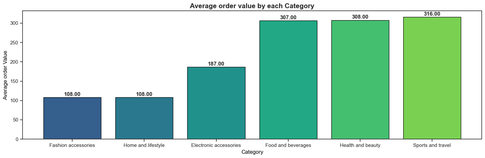
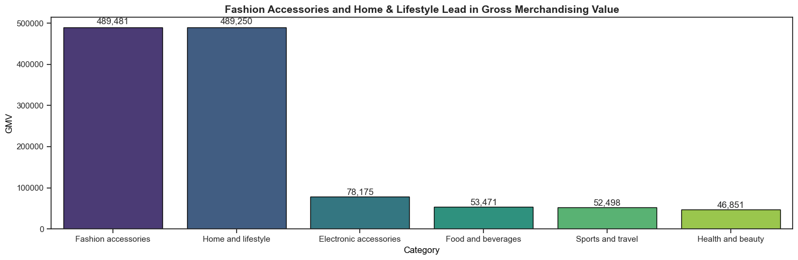
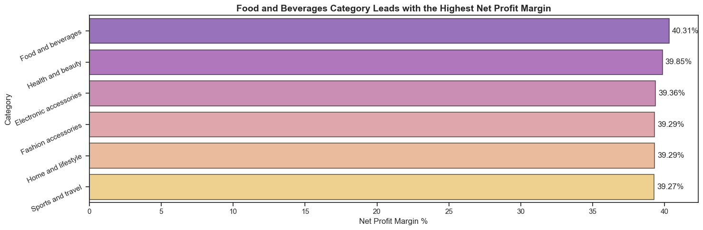
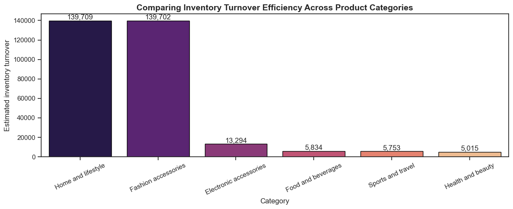
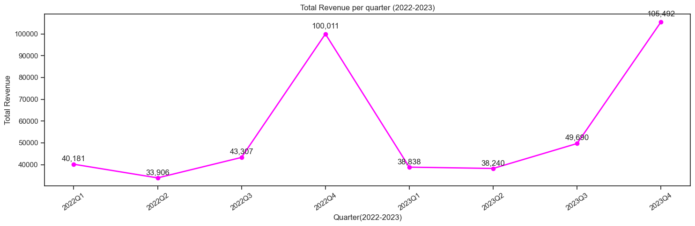

  

<h1 align="center">Walmart Sales & Profitability Performance Report</h1>

---

## 🏢 Project Background

**Walmart** is one of the world’s leading retail corporations, with operations spanning across multiple regions and branches.  
This project presents a detailed **sales and profitability performance analysis** based on transactional data collected between **2019 and 2023**, aiming to identify patterns in sales growth, profitability, and customer behavior.

The analysis helps evaluate how product categories, customer preferences, and seasonal trends influence Walmart’s revenue and profit margins.

---

## 💾 Dataset Overview

📘 **Dataset Source:**  
[Walmart 10k Sales Dataset – Kaggle](https://www.kaggle.com/datasets/najir0123/walmart-10k-sales-datasets)  
or local file: [`walmart_clean.csv`](walmart_clean.csv)

### 🧾 Data Schema

| Column Name      | Data Type | Description                                     |
| ---------------- | --------- | ----------------------------------------------- |
| `invoice_id`     | string    | Unique identifier for each transaction          |
| `branch`         | string    | Store branch code (A, B, C, etc.)               |
| `city`           | string    | City where the branch is located                |
| `category`       | string    | Product category purchased                      |
| `unit_price`     | float     | Price per unit sold                             |
| `quantity`       | integer   | Units purchased per transaction                 |
| `date`           | datetime  | Transaction date                                |
| `time`           | datetime  | Transaction time (used for shift analysis)      |
| `payment_method` | string    | Payment type used (Cash, Credit card, E-wallet) |
| `rating`         | float     | Customer satisfaction rating (1–10)             |
| `profit_margin`  | float     | Estimated profit margin per transaction         |

🕓 **Time Range:** 2019–2023  
📊 **Records:** 9,969 transactions across 100 branches  
💰 **Total Revenue:** $1.21M | **Net Profit:** $476K | **Avg. Margin:** 40%

---

## 📈 Executive Summary

Walmart’s performance between **2019–2023** highlights a consistent profit margin across categories, with **Fashion Accessories** and **Home & Lifestyle** driving the majority of revenue.  
Customer purchasing behavior peaks in **Q4** each year, suggesting strong **seasonal trends** tied to year-end promotions.

| Metric             | Value      | Description                      |
| ------------------ | ---------- | -------------------------------- |
| Total Transactions | 9,969      | Recorded across all branches     |
| Total Revenue      | $1,209,726 | Aggregate revenue from 2019–2023 |
| Net Profit         | $476,139   | Profit after deductions          |
| Avg. Rating        | 5.83       | Average customer rating          |
| Avg. Profit Margin | 40%        | Mean net profit ratio            |

---

## 🧩 Analysis Breakdown

### 1️⃣ Average Order Value (AOV) per Category

**Question:** Which product category generates the highest average order value?

**Insight:**

- **Sports & Travel**, **Health & Beauty**, and **Food & Beverages** categories attract **high-spending customers**.
- This suggests that current marketing strategies effectively drive larger purchase values in these segments.

---

### 2️⃣ Gross Merchandising Value (GMV)

**Question:** Which categories contribute most to total GMV?

**Insight:**

- **Fashion Accessories** and **Home & Lifestyle** generate the **highest GMV**, together dominating Walmart’s total sales.
- Other categories show lower contribution, suggesting **potential for diversification** or **category marketing reinforcement**.

---

### 3️⃣ Net Profit Margin (NPM)

**Question:** Which product category achieves the best profit efficiency?

| Category               | Total Revenue | Net Profit | Net Profit Margin (%) |
| ---------------------- | ------------- | ---------- | --------------------- |
| Food & Beverages       | $53,471       | $21,553    | **40.31%**            |
| Health & Beauty        | $46,851       | $18,672    | **39.85%**            |
| Electronic Accessories | $78,175       | $30,772    | **39.36%**            |
| Fashion Accessories    | $489,481      | $192,315   | **39.29%**            |
| Home & Lifestyle       | $489,250      | $192,214   | **39.29%**            |
| Sports & Travel        | $52,498       | $20,614    | **39.27%**            |

**Insight:**

- Profit margins are **stable (~39–40%)**, showing strong operational consistency.
- **Food & Beverages** leads slightly, suggesting **effective cost control** despite smaller volume.
- **Fashion Accessories** and **Home & Lifestyle** have thinner margins but larger scale, implying high sales but tighter competition.

---

### 4️⃣ Inventory Turnover Efficiency

**Question:** Does high turnover align with efficient sales or stock movement?

| Category               | COGS    | Avg. Inventory | Turnover    |
| ---------------------- | ------- | -------------- | ----------- |
| Home & Lifestyle       | 297,036 | 2.0            | **139,709** |
| Fashion Accessories    | 297,166 | 2.0            | **139,702** |
| Electronic Accessories | 47,403  | 4.0            | **13,294**  |
| Food & Beverages       | 31,918  | 5.0            | **5,834**   |
| Sports & Travel        | 31,884  | 6.0            | **5,753**   |
| Health & Beauty        | 28,179  | 6.0            | **5,015**   |

**Insight:**

- **Home & Lifestyle** and **Fashion Accessories** have extremely high turnover, reflecting strong demand and fast-moving stock.
- Slower categories (**Health & Beauty**, **Sports & Travel**) may face **inventory inefficiencies** or **overstocking**.

---

### 5️⃣ Quarterly Revenue Trend (2022–2023)

**Question:** Which quarter recorded the highest revenue?

**Insight:**

- **Q4** consistently peaks in both 2022 and 2023 (up to **$105K**), reflecting strong **holiday season performance**.
- **Q2–Q3** remain stable but lower — Walmart could explore **mid-year campaigns** to smooth seasonal fluctuations.

---

## 💡 Key Recommendations

| Area                  | Recommendation                                                             | Expected Impact          |
| --------------------- | -------------------------------------------------------------------------- | ------------------------ |
| **Sales**             | Strengthen off-season campaigns (Q1–Q2) to reduce sales gaps.              | Increase annual revenue  |
| **Product**           | Focus inventory on **Fashion Accessories** & **Home & Lifestyle**.         | Reduce stockouts         |
| **Profitability**     | Review supplier terms in high-volume categories to lift margins.           | Improve NPM by +2–3%     |
| **Customer Behavior** | Incentivize repeat purchases in **Sports & Travel** & **Health & Beauty**. | Boost AOV                |
| **Seasonal Strategy** | Leverage Q4 trends with early marketing rollouts.                          | Sustain peak performance |

## 📈 Business Recomendation :

- 1️⃣ Focus marketing and cross-selling efforts on Sports & Travel, Health & Beauty, and Food & Beverages, which show the highest AOV. These categories attract high-spending customers, so personalized promotions or bundle discounts could increase order frequency without lowering ticket size. For lower AOV categories, review pricing strategy or product bundling to lift average spend per transaction.
- 2️⃣ Maintain strong momentum in Fashion Accessories and Home & Lifestyle, which are the top revenue drivers. However, to sustain long-term growth, consider developing targeted campaigns to boost underperforming categories like Electronics and Food & Beverages. This diversification reduces revenue dependency on a few product lines and supports balanced portfolio growth.
- 3️⃣ While overall margins are stable across categories (~39–40%), focus on optimizing cost efficiency within Fashion Accessories and Home & Lifestyle, which, despite high sales, operate on thinner margins. A cost review or supplier negotiation in these categories could increase profitability. Additionally, replicate successful pricing or sourcing strategies from Food & Beverages, which demonstrates better margin efficiency.
- 4️⃣ Ensure sufficient stock levels for Home & Lifestyle and Fashion Accessories, where rapid turnover reflects high demand. At the same time, evaluate inventory management for Health & Beauty and Sports & Travel, which show slower rotation — consider reducing order volume, running promotions, or optimizing SKU assortment to avoid capital lock-up in low-movement inventory.
- 5️⃣ Leverage Q4’s strong seasonal momentum by planning early campaigns and inventory ramp-ups before peak season. To stabilize revenue across the year, explore strategies that drive engagement during off-peak quarters (Q2–Q3), such as mid-year promotions, loyalty programs, or special product launches. This helps smooth out sales volatility and maintain consistent cash flow.

---

## ⚙️ Technical Implementation

**Tools Used**

- Python (Pandas, Seaborn, Matplotlib)
- SQL (PostgreSQL)
- Tableau / Looker Studio
- VS Code + DBeaver
